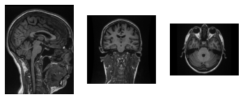

# Brain segmentation

Brain segmentation from sequence T1 type of MRI as is show below. 

## Dataset

Dataset was in medical *.nii format and I used nibabel library to read it. As output I had 3 dimensional matrix from which I can extracted images from 3 axes. 

I checked maximum size of this image (it was 288) and created dataset that contains only images with size 288x288 in grayscale. To do this, I added to smaller images padding with zero pixel value.

Data extracted from *.nii files has different values, so I divided them by maximum value from all 3d matrix. So I 
get all data normalized with the same shape and the same pixel values. 

It is important to tell that data from different axes were placed in different datasets and used to train different networks, what will be described in next sections.

## Network architecture

My approach was to use UNet architecture with pretrained weights. I found repository whose author use this neural network to detect brain tumor so dataset which he used to train was similar (https://github.com/adityajn105/brain-tumor-segmentation-unet). So I can quickly train network to my needs. I also changed encoder input from 3 channels to one.

My approach was to train 3 models - one for every axis. To predict brain mask, I made predictions in every axis for every image, then I built 3d matrix and then I made average value of every value in this matrix. This approach gives better results than training one model in one axis.

To judge working models I used Dice Loss. Here are some predictions score for test data:

| Sample  | Dice loss axis 1  | Dice loss axis 2  | Dice loss axis 3  | Dice loss for average prediction |
|---|---|---|---|---|
|1.   | 0.9874  | 0.9866  | 0.9852  | 0.9886  |
|2.   | 0.7985  | 0.9800  | 0.9242  | 0.9651  |
|3.   | 0.9867  | 0.9868  | 0.9872  | 0.9893  |

Values from predictions for all test data are in **test_results** path.

To evaluate score for all data I average dice loss for every sample to every model and there are results:

| Model  | Avg dice loss for test data  |
|---|---|
| predictions on ax1  | 0.9704  |
| predictions on ax2  | 0.9691  |
| predictions on ax3  | 0.9629  |
| avg predictions     | 0.9811  |
